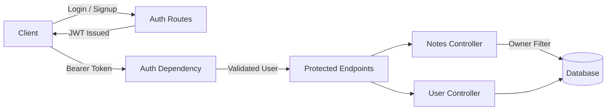

# pyNotes 📝  
**Secure Personal Notes Management System (API + Server-Side Rendering)**


## 📌 Overview

**pyNotes** is a backend-driven, security-focused **personal notes management platform** engineered using **FastAPI** with **JWT-based authentication**, **MongoDB persistence**, and **server-side rendered UI using Jinja2**.

The system is designed to demonstrate **real-world backend engineering practices**, including:
- Authentication correctness
- Ownership-based authorization
- User-level data isolation
- Clean API contracts
- Separation of concerns across layers

Each authenticated user can create, view, update, and delete **only their own notes**, ensuring strict multi-tenant isolation similar to production SaaS systems.


## 🎯 Key Objectives

- Implement secure user authentication using JWT (OAuth2 password flow)
- Enforce ownership-based access control at the database level
- Prevent unauthorized cross-user data access
- Support both REST APIs and server-rendered views
- Maintain a scalable, interview-ready backend architecture


## 🧠 How It Works (High-Level Flow)

1. User registers or logs in via authentication endpoints  
2. Server validates credentials and issues a signed JWT  
3. JWT is stored client-side and sent with each request  
4. FastAPI dependencies validate and decode the token  
5. User identity is injected into request context  
6. Notes queries are filtered strictly by authenticated user ID  
7. Data is rendered via JSON APIs or Jinja2 templates  


## 🧩 System Workflow Diagram


## ✅ Verified Functional Behavior

The following behaviors were validated through manual testing and API inspection:

- JWT tokens are generated and validated correctly  
- Unauthorized users are blocked from protected routes  
- Authenticated users can access only their own notes  
- Database queries are scoped by user ownership  
- Invalid or expired tokens return proper HTTP errors  

✔️ Confirms authentication integrity  
✔️ Confirms authorization enforcement  
✔️ Confirms secure multi-user isolation  


## 🧩 Tech Stack

### Backend
- Python 3.12  
- FastAPI  
- Uvicorn (ASGI Server)  
- JWT Authentication  
- OAuth2 Password Flow  
- MongoDB  
- Pydantic (Data Validation)  

### Frontend (Server-Side Rendered)
- HTML5  
- CSS3  
- Jinja2 Templates  

### Architecture & Practices
- RESTful API design  
- MVC-style project structure  
- Dependency Injection  
- Ownership-based authorization  
- Stateless backend services  

## 📂 Project Structure
```
pyNotes/
├── app/
│   ├── core/
│   │   ├── config.py
│   │   └── security.py
│   ├── database/
│   │   ├── db.py
│   │   └── models.py
│   ├── routers/
│   │   ├── auth.py
│   │   └── notes.py
│   ├── schemas/
│   │   ├── user.schema.py
│   │   └── note.schema.py
│   ├── templates/
│   │   ├── base.html
│   │   ├── login.html
│   │   └── notes.html
│   ├── static/
│   │   └── styles.css
│   ├── dependencies.py
│   └── main.py
├── requirements.txt
├── README.md
└── .gitignore
```


## ⚙️ Run Locally (Development Setup)

This section describes how to fork, clone, and run **pyNotes** locally for development and testing.

### 1️⃣ Fork the Repository
- Navigate to the **pyNotes** repository on GitHub  
- Click the **Fork** button (top-right) to create a copy under your GitHub account  

This allows you to:
- Work independently  
- Push changes to your own repository  
- Open pull requests if contributing back  

### 2️⃣ Clone Your Fork
```
git clone https://github.com/<your-username>/pyNotes.git
cd pyNotes
```
Replace <your-username> with your GitHub username.

#### Using Terminal (Optional)
```
python -m venv .venv
source .venv/bin/activate      # Linux / macOS
.venv\Scripts\activate         # Windows
```
### 4️⃣ Install Dependencies

All required dependencies are defined in requirements.txt.

pip install -r requirements.txt


The project uses FastAPI (standard distribution), which includes
development tooling and integrates with Uvicorn internally.


### 5️⃣ Configure Environment Variables

#### Create a .env file in the project root:
```
MONGO_URI=your_mongodb_connection_string
JWT_SECRET=your_jwt_secret
JWT_ALGORITHM=HS256
ACCESS_TOKEN_EXPIRE_MINUTES=30
```

Ensure MongoDB is running locally or accessible via Atlas.

### 6️⃣ Run the Application (Local Development)

- Start the development server using FastAPI’s built-in CLI:
```
fastapi dev app/main.py
```

#### Server starts at:

```http://127.0.0.1:8000```


- Auto-reload is enabled for development

- No direct uvicorn command is required

### 7️⃣ Verify the Setup

- Once the server is running, verify using:

#### Swagger UI

```http://127.0.0.1:8000/docs```


#### ReDoc

```http://127.0.0.1:8000/redoc```


- These documentation UIs are auto-generated by FastAPI from the OpenAPI schema.

## 🧠 Development Notes

Dependencies are managed exclusively via requirements.txt

The virtual environment is intentionally excluded from version control

Configuration is environment-driven using .env

The project uses a modern FastAPI-native dev workflow (fastapi dev)

Focus is on backend correctness and security, not UI completeness

## 🚨 Common Issues

- fastapi command not found
→ Ensure FastAPI is installed inside the active virtual environment

- MongoDB connection errors
→ Verify MONGO_URI and database availability

- Port already in use
→ Stop the conflicting service or run on a different port


## 🔒 System Characteristics
- Stateless REST APIs  
- JWT-based authentication  
- Ownership-scoped database access  
- Secure dependency-based authorization  
- Server-side rendered HTML using Jinja2  
- Clear separation between routes, services, and data layers

## 🔐 Authentication & Session Management

### Key Design Points
- Authentication is implemented using **JWT-based access tokens**  
- Tokens are issued upon successful login and stored in **HTTP-only cookies**  
- HTTP-only cookies prevent JavaScript-level access to tokens, reducing **XSS risk**  
- Cookies are automatically attached to subsequent requests by the browser  
- **FastAPI dependencies** extract and validate JWTs from incoming cookies  
- The backend remains **stateless**, with no server-side session storage  


## 🛡️ Authorization & User-Level Data Isolation

### Key Principles
- Each note is associated with a **specific user identifier**  
- Authenticated user identity is derived from the **validated JWT**  
- All note queries are **filtered by the authenticated user’s ID**  
- Cross-user access is impossible due to **query-level scoping**  
- Authorization is enforced on the **backend**, not the frontend  


## 🚧 Known Limitations
- No refresh-token implementation yet  
- Minimal UI (focus is backend correctness)  
- Single-role user system  


## 📸 Application Demo (Screenshots)


## 🛣️ Future Enhancements
- Refresh tokens & token rotation  
- Role-based access control (RBAC)  
- Full-text search on notes  
- Tagging and categorization  
- Dockerized deployment  
- Optional React frontend  


## 🤝 Contribution
Contributions are welcome, especially in areas such as:
- Backend security improvements  
- Database indexing & optimization  
- UI/UX enhancements  
- API documentation refinements  

This project is intentionally structured to help developers understand real-world authentication and authorization patterns.


## 📄 License
This project is licensed under the **MIT License**.


## 👤 Author

**Samrat Saha**  
Backend & Full-Stack Developer  

